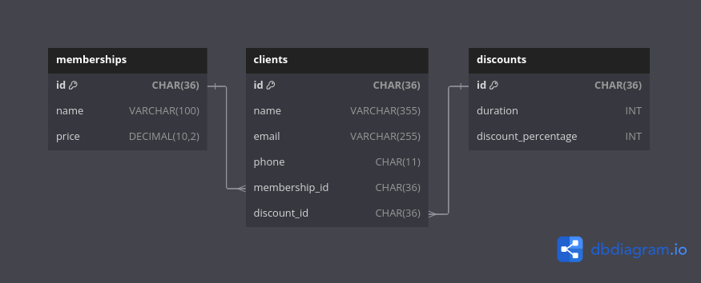

# Projeto 01 - Desenvolvimento Web com Java

## Sobre o projeto

[Link do vídeo do projeto](https://youtu.be/nBLm5Y4RCMg)

Foi desenvolvido um sistema de gerenciamento de clientes de uma academia, onde
é possível visualizar os clientes já cadastrados, cadastrar novos clientes,
editar um cliente e deletar um cliente.

Também é possível visualizar os planos e descontos já cadastrados no sistema.
(Devido ao tempo apertado, não foi possível implementar a criação, atualização
e exclusão de planos e descontos, então ficará como implementações futuras
para o projeto).

As tecnologias utilizadas no projeto foram:
- Java (Lógica de Negócio e Tratamento de Rotas)
- Maven (Compilação e empatocamento do projeto)
- MySQL (Banco de dados)
- JDBC (Conexão com banco de dados)
- JSP (JavaServer Pages para visualização)
- CSS (Estilização)

O projeto segue a Arquitetura MVC (Model-View-Controller) com as seguintes funções:
- Model: DAO (Data Access Object)
- Controller: DTO (Data Transfer Object)
- View: Páginas JSP (JavaServer Pages)
 
## Organização de Arquivos

- DAOs
  - `ClientDAO.java`
  - `DiscountDAO.java`
  - `MembershipDAO.java`
- DTOs
  - `ClientDTO.java`
  - `DiscountDTO.java`
  - `IDTO.java`
  - `MembershipDTO.java`
- Servlets
  - `CLientServlet.java`
  - `EditClientServlet.java`
  - `MembershipAndDiscountServlet.java`
  - `NewClientServlet.java`
- Utils
  - `DatabaseConnectionFactory.java`
- JSPs (Views)
  - `editClient.jsp`
  - `error.jsp`
  - `index.jsp`
  - `listClients.jsp`
  - `listMembershipsAndDiscounts.jsp`
  - `newClient.jsp`
- CSS
  - `globals.css`
  - `style.css`

## Banco de Dados

### Tabelas


### Script

```sql
DROP DATABASE IF EXISTS gym_db;
CREATE DATABASE gym_db;
USE gym_db;

CREATE TABLE memberships (
    id CHAR(36) PRIMARY KEY,
    name VARCHAR(100) NOT NULL,
    price DECIMAL(10, 2) NOT NULL
);

CREATE TABLE discounts (
    id CHAR(36) PRIMARY KEY,
    duration INT NOT NULL,
    discount_percentage INT NOT NULL
);

CREATE TABLE clients (
    id CHAR(36) PRIMARY KEY,
    name VARCHAR(255) NOT NULL,
    email VARCHAR(255),
    phone CHAR(11),
    membership_id CHAR(36),
    discount_id CHAR(36),

    FOREIGN KEY (membership_id) REFERENCES memberships(id) ON DELETE SET NULL,
    FOREIGN KEY (discount_id) REFERENCES discounts(id) ON DELETE SET NULL
);

INSERT INTO memberships (id, name, price) VALUES
    (UUID(), 'Basic', 55.90),
    (UUID(), 'Silver', 129.90),
    (UUID(), 'Gold', 269.90);

INSERT INTO discounts (id, duration, discount_percentage) VALUES
    (UUID(), 1, 0),
    (UUID(), 3, 10),
    (UUID(), 6, 15),
    (UUID(), 12, 20);

INSERT INTO clients (id, name, email, phone, membership_id, discount_id) VALUES
    (UUID(), 'João Carvalho', 'joao.carvalho@gmail.com', '11943545213',
        (SELECT id FROM memberships WHERE name = 'Basic'),
        (SELECT id FROM discounts WHERE duration = '1')),
    (UUID(), 'Lucas Vinícius', 'lucas@vinicius@gmail.com', '19932985647',
        (SELECT id FROM memberships WHERE name = 'Silver'),
        (SELECT id FROM discounts WHERE duration = '3')),
    (UUID(), 'Júlia Martins', 'julia.martins@gmail.com', '19943567890',
        (SELECT id FROM memberships WHERE name = 'Gold'),
        (SELECT id FROM discounts WHERE duration = '6'));

```

## Rotas
 
ROTA                      | HTTP REQUEST | FUNÇÃO
------------------------- | -------------| -------------------------------------
`/clientes`               | GET          | Abre a página de listar clientes e lista todos os clientes
`/clientes`               | POST         | Salva um novo cliente
`/clientes?id={id}`       | DELETE       | Deleta um cliente utilizando seu `id`
`/clientes?id={id}`       | PUT          | Edita um cliente utilizando seu `id`
`/editar-cliente?id={id}` | PUT          | Abre a página de edição de um cliente utilizando seu `id`
`/novo-cliente`           | GET          | Abre a página de criação de um novo cliente
`/planos`                 | GET          | Abre a página de listar planos e descontos, e lista todos os planos e descontos
